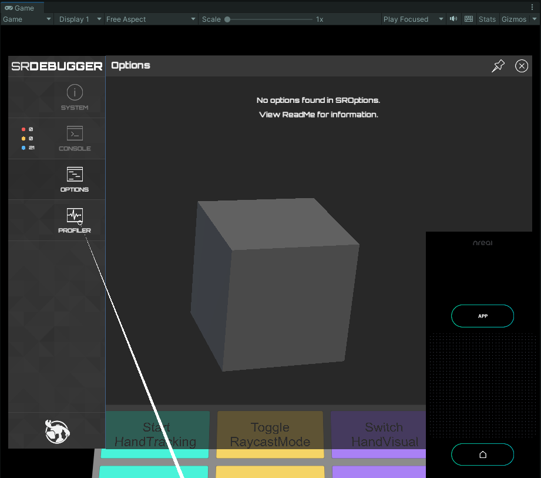

# SRDebuggerUtils

SRDebugger is a useful tool for debugging on mobile devices. 
Samples in this package include Prefab, which displays the SRDebugger UI in the world space of various HMDs and AR glasses and can be interacted with by controllers.

> **Note**  
> SRDebugger is not included in this package. Please purchase it from the Unity Asset Store and install it separately in your project.

## Installation

`https://github.com/bigdra50/SRDebuggerUtils.git?path=Assets/SRDebuggerUtils`

## Requirement

- [SRDebugger](https://assetstore.unity.com/packages/tools/gui/srdebugger-console-tools-on-device-27688)

## Samples

### Nreal

Triple-tap the controller and the SRDebugger window will appear on the world space.  
NRSDK is not included in this package, so please import it by yourself.

  

### Oculus

Triple-click the right thumbstick on the controller and the SRDebugger window will appear in world space.  
Oculus Integration is not included in this package, so please import it by yourself.
